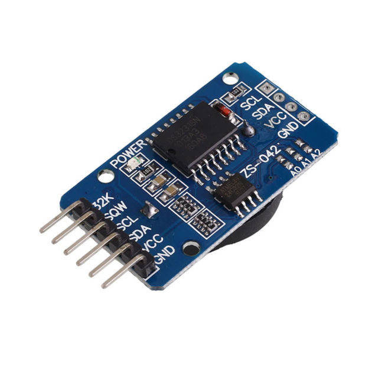

# DS3231 RTC drive

Basic DS3231 RTC drive



## About

This is a easily portable low level DS3231 drive. Current version represents basic drive with ability to set and read time to/from
DS3231 RTC. There is still few features left to implement, and those are:
* Use Alarm 1 with IRQ
* Use Alarm 2 with IRQ
* Aging offset
* Square wave signal generator
* Read temperature

This features are optional.

## Porting to other MCUs
For this drive to work on other MCUs you need to redefine next macros

  ```
  #define ds3231_i2c_init()                       i2c_init(I2C_PRESCALER_1,72)
  #define ds3231_i2c_tx_byte(address,data,cnt)    i2c_tx_data(address,data,cnt)
  #define ds3231_i2c_rx_byte(address,data,cnt)    i2c_rx_data(address,data,cnt)
  #define DS3231_CENTURY                          21
  ```

  * ds3231_i2c_init() - Initialize I2C peripheral with clock speed in range 100 - 400 [kHz]
  * ds3231_i2c_tx_byte() - Send array of data to slave device with appropriate address
  * ds3231_i2c_rx_byte() - Receive array of data from slave device with appropriate address
  * DS3231_CENTURY - Current century

## Writing and reading data from DS3231 internal register

Reading and writing data to DS3231 register is well documented in provided datasheet. But still, when developing this drive things didn't go so smoothly as I have hoped. This was actually my fault because I didn't read datasheet carefully, and I missed the information about the minimum time for which the bus line has to be IDLE between STOP and START condition. (min 4.7 us)


## Authors

  * **Semir Tursunovic** - semir-t

## License

  This project is licensed under the MIT License - see the [LICENSE.md](LICENSE.md) file for details


