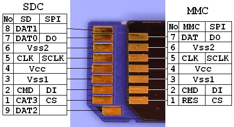
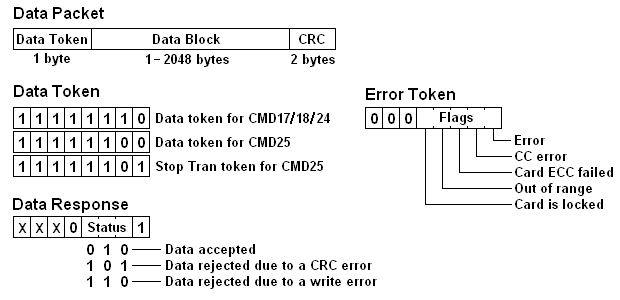

# MMC/SD Card drive

Low level MMC/SD card drive.

## About
This is a easily portable low level MMC/SD card drive. Current version supports MMC and SDv1 cards, but only MMC was properly tested so there is no guarantee for SDv1 cards. This library contains basic functions for initializatiing MMC/SD card, and for reading/writing data to 512B sectors.

With minor modifications, this library can be used as a core drive for Elm Chans [FatFS](http://elm-chan.org/fsw/ff/00index_e.html)

## Porting drive to other MCU
For this drive to work on other MCUs you need to redefine next macros

```
#define mmc_spi_init(prescaler)             spi_master_init(prescaler)
#define mmc_spi_rxtx_byte(data)             spi_rxtx_byte(data)
#define MMC_SS_LOW                          SPI_SS_LOW
#define MMC_SS_HIGH                         SPI_SS_HIGH
#define MMC_CLK_SLOW()                      spi_baudrate(SPI_BAUDRATE_PRESCALER_64)
#define MMC_CLK_FAST()                      spi_baudrate(SPI_BAUDRATE_PRESCALER_16)
```
* mmc_spi_master_init(prescaler) - SPI peripheral should be initialize in MODE0 with low clock speed
* mmc_spi_rxtx_byte(data) -  Send data via SPI. This function returns value received via SPI
* MMC_SS_LOW - Pull SS line LOW
* MMC_SS_HIGH - Pull SS line HIGH
* MMC_CLK_SLOW() - Change SPI clock speed (100 - 400 kHz)
* MMC_CLK_FAST() - Change SPI clock speed to higher values which dependins on the MMC/SD card used


## Pinout
Right photo shows the contact surface of the SDC/MMC. The MMC has seven contact pads. The SDC has nine contact pads that two additional contacts to the MMC. The three of the contacts are assigned for power supply, so that the number of effective signals are four (MMC) and six (SDC). Therfore the data transfer between the host and the card is done via a synchronous serial interface.



The working supply voltage range is indicated by the operation conditions register (OCR) and it should be read and comfirmed the operating voltage range at card initialization. However, the supply voltage can also be fixed to 3.0 to 3.3 volts withouth any confirmation because the all MMC/SDCs work at 2.7 to 3.6 volts at least. Do not supply 5.0 volts to the card, or the card is damaged instantly. The current consumption on write operation can reach up to some ten miliamperes, so that the host system should consider to supply 100 miliamperes to the card.

## SPI mode
### Activating MMC/SD card
SPI bus can have multiple slave devices. Device selection is performed by pulling SS(CS) pin LOW. (In idle state this pin is pulled HIGH).
This is also the case when we use MMC/SD cards in SPI mode. When we want to select MMC/SD card, we have to pull SS(CS) line LOW. But, before doing this we have to activate MMC/SD card. This is done byte sending 0xff through MOSI line while SS line is HIGH.

Steps to take when selecting the MMC/SD card:
* Pull SS line HIGH
* Send 0xff via MOSI line
* Pull SS line LOW
* Check if MMC/SD card is busy

Steps to take when deselecting the card:
* Pull SS line HIGH

### Command and Response

In SPI mode, the data direction on the signal lines are fixed and the data is transferred in byte oriented serial communication. The command frame from host to card is a fixed length packet that shown below. The card is ready to receive a command frame when it drives DO high.

After a command frame is sent to the card, a response to the command (R1, R2, R3 or R7) is sent back from the card. Because the data transfer is driven by serial clock generated by host controller, the host controller must continue to read data, send a 0xFF and get received byte, until a valid response is detected. The DI signal must be kept high during read transfer (send a 0xFF and get the received data). The response is sent back within command response time (NCR), 0 to 8 bytes for SDC, 1 to 8 bytes for MMC.

The CS signal must be driven high to low prior to send a command frame and held it low during the transaction (command, response and data transfer if exist). The CRC feature is optional in SPI mode. CRC field in the command frame is not checked by the card.


### SPI Command Set

Each command is expressed in abbreviation like GO_IDLE_STATE or CMD<n>, <n> is the number of the command index and the value can be 0 to 63. Following table describes only commands that to be usually used for generic read/write and card initialization. For details on all commands, please refer to spec sheets from MMCA and SDA.


### SPI Response

There are some command response formats, R1, R2, R3 and R7, depends on the command index. A byte of response, R1, is returned for most commands. The bit field of the R1 response is shown in right image, the value 0x00 means successful. When any error occured, corresponding status bit in the response will be set. The R3/R7 response (R1 + trailing 32-bit data) is for only CMD58 and CMD8.


Some commands take a time longer than NCR and it responds R1b. It is an R1 response followed by busy flag (DO is driven to low as long as internal process is in progress). The host controller should wait for end of the process until DO goes high (a 0xFF is received).

## Initialization Procedure for SPI Mode

After power on reset, MMC/SDC enters its native operating mode. To put it SPI mode, follwing procedure must be performed like this flow.
Power ON or card insersion

After supply voltage reached 2.2 volts, wait for one millisecond at least. Set SPI clock rate between 100 kHz and 400 kHz. Set DI and CS high and apply 74 or more clock pulses to SCLK. The card will enter its native operating mode and go ready to accept native command.
Software reset

Send a CMD0 with CS low to reset the card. The card samples CS signal on a CMD0 is received successfully. If the CS signal is low, the card enters SPI mode and responds R1 with In Idle State bit (0x01). Since the CMD0 must be sent as a native command, the CRC field must have a valid value. When once the card enters SPI mode, the CRC feature is disabled and the CRC is not checked by the card, so that command transmission routine can be written with the hardcorded CRC value that valid for only CMD0 and CMD8 with the argument of zero. The CRC feature can also be switched with CMD59.
Initialization

In idle state, the card accepts only CMD0, CMD1, ACMD41,CMD58 and CMD59. Any other commands will be rejected. In this time, read OCR register and check working voltage range of the card. In case of the system sypply voltage is out of working voltage range, the card must be rejected. Note that all cards work at supply voltage range of 2.7 to 3.6 volts at least, so that the host contoller needs not check the OCR if supply voltage is in this range. The card initiates the initialization process when a CMD1 is received. To detect end of the initialization process, the host controller must send CMD1 and check the response until end of the initialization. When the card is initialized successfuly, In Idle State bit in the R1 response is cleared (R1 resp changes 0x01 to 0x00). The initialization process can take hundreds of milliseconds (large cards tend to longer), so that this is a consideration to determin the time out value. After the In Idle State bit cleared, generic read/write commands will able to be accepted.

Because ACMD41 instead of CMD1 is recommended for SDC, trying ACMD41 first and retry with CMD1 if rejected, is ideal to support both type of the cards.

The SCLK rate should be changed to fast as possible to maximize the read/write performance. The TRAN_SPEED field in the CSD register indicates the maximum clock rate of the card. The maximum clock rate is 20MHz for MMC, 25MHz for SDC in most case. Note that the clock rate will able to be fixed to 20/25MHz in SPI mode because there is no open-drain condition that restricts the clock rate.

## Data Transfer
### Data Packet and Data Response

In a transaction with data transfer, one or more data blocks will be sent/received after command response. The data block is transferred as a data packet that consist of Token, Data Block and CRC. The format of the data packet is showing in image and there are three data tokens. Stop Tran token is to terminate a multiple block write transaction, it is used as single byte packet without data block and CRC.



### Single block read
The argument specifies the location to start to read in unit of byte or block. The sector address in LBA specified by upper layer must be scaled properly. When a CMD17 is accepted, a read operation is initiated and the read data block will be sent to the host. After a valid data token is detected, the host controller receives following data field and CRC. The CRC bytes must be received even if it is not needed. If any error occured during the read operation, an error token will be returned instead of data packet.


### Multiple Block Read

The CMD18 is to read multiple blocks in sequense from the specified location. The read operation continues as open-ended. To terminate the transaciton, send a CMD12 to the card. The received byte immediataly following CMD12 is a stuff byte, it should be discarded before receive the response of the CMD12. For MMC, if number of transfer blocks has been sepecified by CMD23 prior to CMD18, the read transaction is initiated as a pre-defined multiple block transfer and the read operation is terminated at last block transfer.


### Single Block Write

The Single Block Write writes a block to the card. After a CMD24 is accepted, the host controller sends a data packet to the card. The packet format is same as block read operations. Most cards cannot change write block size and it is fixed to 512. The CRC field can have any fixed value unless the CRC function is enabled. The card responds a Data Response immediataly following the data packet from the host. The Data Response trails a busy flag and host controller must wait until the card goes ready.

In principle of the SPI mode, the CS signal must be kept asserted during a transaction. However there is an exception to this rule. When the card is busy, the host controller can deassert CS to release SPI bus for other SPI devices on the bus. The card will drive DO low again when reselected during internal process is in progress. Therefore a preceding busy check, check if card is busy prior to each command and data packet, instead of post wait can eliminate the busy wait time. In addition, the internal write process is initiated a byte after the data response, this means eight SCLK clocks are required to initiate internal write operation. The state of CS signal during the post clocks can be either low or high, so that it can be done with bus release process described below.


### Multiple Block Write

The Multiple Block Read command writes multiple blocks in sequense from the specified location. After a CMD25 is accepted, the host controller sends one or more data packets to the card. The packet format is same as block read operations except for Data Token. The write operation continues until terminated with a Stop Tran token. The busy flag will output after each data block and Stop Tran token. For MMC, the number of blocks to write can be pre-defined by CMD23 prior to CMD25 and the write transaction is terminated at last data block. For SDC, number of sectors to pre-erased at start of write transaction can be specified by ACMD23 prior to CMD25. A Stop Tran token is always required to treminate the write transaction. It can also be terminated at smaller or larger than pre-erased blocks but the content of the pre-erased and not transferred blocks are undefined.


### Reading CSD and CID

These are same as Single Block Read except for the data block length. The CSD and CID are sent to the host as 16 byte data block. For details of the CMD, CID and OCR, please refer to the MMC/SDC specs.
## Authors

* **Semir Tursunovic** - semir-t

## License

This project is licensed under the MIT License - see the [LICENSE.md](LICENSE.md) file for details


## Acknowledgments
* Most of the information found in this README can be found on Elm Chans [FatFS](http://elm-chan.org/fsw/ff/00index_e.html) site
