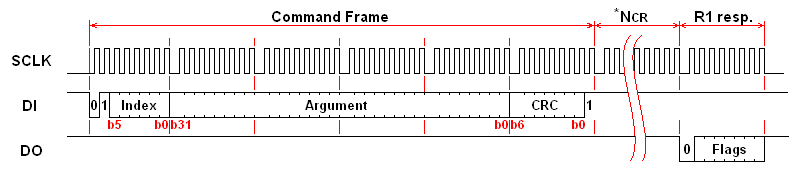

# MMC/SD Card drive

Low level MMC/SD card drive.

## About
This is a easily portable low level MMC/SD card drive. Current version supports MMC and SDv1 cards, but only MMC was properly tested so there is no guarantee for SDv1 cards. This library contains basic functions for initializatiing MMC/SD card, and for reading/writing data to 512B sectors.

With minor modifications, this library can be used as a core drive for Elm Chans [FatFS](http://elm-chan.org/fsw/ff/00index_e.html)

## Pinout
Right photo shows the contact surface of the SDC/MMC. The MMC has seven contact pads. The SDC has nine contact pads that two additional contacts to the MMC. The three of the contacts are assigned for power supply, so that the number of effective signals are four (MMC) and six (SDC). Therfore the data transfer between the host and the card is done via a synchronous serial interface.

The working supply voltage range is indicated by the operation conditions register (OCR) and it should be read and comfirmed the operating voltage range at card initialization. However, the supply voltage can also be fixed to 3.0 to 3.3 volts withouth any confirmation because the all MMC/SDCs work at 2.7 to 3.6 volts at least. Do not supply 5.0 volts to the card, or the card is damaged instantly. The current consumption on write operation can reach up to some ten miliamperes, so that the host system should consider to supply 100 miliamperes to the card.

## SPI mode
### Activating MMC/SD card
SPI bus can have multiple slave devices. Device selection is performed by pulling SS(CS) pin LOW. (In idle state this pin is pulled HIGH).
This is also the case when we use MMC/SD cards in SPI mode. When we want to select MMC/SD card, we have to pull SS(CS) line LOW. But, before doing this we have to activate MMC/SD card. This is done byte sending 0xff through MOSI line while SS line is HIGH.
Steps to take when selecting the MMC/SD card:
* Pull SS line HIGH
* Send 0xff via MOSI line
* Pull SS line LOW
* Check if MMC/SD card is busy
Steps to take when deselecting the card:
* Pull SS line HIGH

### Command and Response

In SPI mode, the data direction on the signal lines are fixed and the data is transferred in byte oriented serial communication. The command frame from host to card is a fixed length packet that shown below. The card is ready to receive a command frame when it drives DO high. After a command frame is sent to the card, a response to the command (R1, R2, R3 or R7) is sent back from the card. Because the data transfer is driven by serial clock generated by host controller, the host controller must continue to read data, send a 0xFF and get received byte, until a valid response is detected. The DI signal must be kept high during read transfer (send a 0xFF and get the received data). The response is sent back within command response time (NCR), 0 to 8 bytes for SDC, 1 to 8 bytes for MMC. The CS signal must be driven high to low prior to send a command frame and held it low during the transaction (command, response and data transfer if exist). The CRC feature is optional in SPI mode. CRC field in the command frame is not checked by the card.

## Authors

* **Semir Tursunovic** - semir-t

## License

This project is licensed under the MIT License - see the [LICENSE.md](LICENSE.md) file for details

